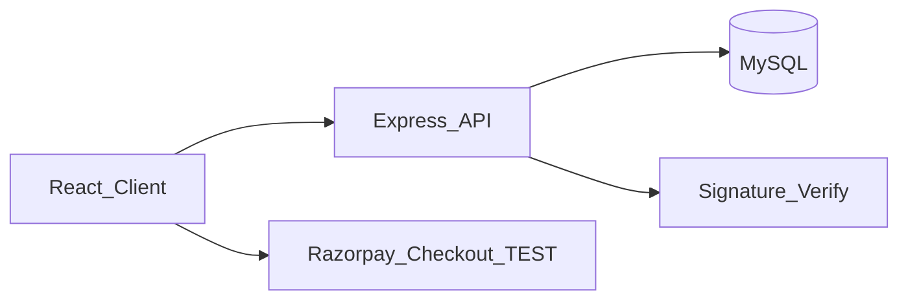

# ShopKart

Full-stack ecommerce platform built with **React (Vite)**, **Node.js/Express**, and **MySQL**.

Built as a **company-resume / job-evaluation project** with JWT auth, transactional checkout, Razorpay **TEST** payments, wishlist, purchase-gated reviews, admin analytics, API tests, and CI.

## Live Demo

- Frontend: `_paste_after_deploy_`
- Backend API: `_paste_after_deploy_`
- GitHub: `_paste_repo_url_`

See [DEPLOY.md](./DEPLOY.md) for hosting steps.

---

## Tech Stack

| Layer | Technology |
|-------|------------|
| Frontend | React 19, Vite, React Router, Recharts |
| Backend | Node.js, Express |
| Database | MySQL |
| Auth | JWT + bcrypt |
| Payments | Razorpay **TEST mode** + COD |
| Quality | Jest + Supertest, GitHub Actions, Helmet, rate limiting, express-validator |

---

## Features

### Customer
- Signup / Login (JWT)
- Search with suggestions, category filters, sort
- Product detail + related items
- Cart + Wishlist
- Checkout: **COD** or **Razorpay TEST** (signature verified)
- Orders history / detail
- Profile editing
- Light / dark theme
- Purchase-gated product reviews & ratings

### Admin
- Dashboard stats
- Analytics charts (revenue, order status, top products)
- Product CRUD
- Order status updates
- RBAC (`admin` role)

---

## Architecture



---

## Local Setup

### Prerequisites
- Node.js 18+
- MySQL running
- Razorpay TEST keys (optional for COD-only)

```sql
CREATE DATABASE shopkart;
```

### Backend

```bash
cd server
cp .env.example .env
# fill DB + JWT + Razorpay TEST keys
npm install
npm run db:setup
npm run db:migrate
npm run db:migrate:profile
npm run db:migrate:payments
npm run dev
```

API: `http://localhost:5000`

### Frontend

```bash
cd client
cp .env.example .env
# set VITE_RAZORPAY_KEY_ID=rzp_test_...
npm install
npm run dev
```

App: `http://localhost:5173`

### Default admin

- Email: `admin@shopkart.com`
- Password: `admin123` (change after first login in real deployments)

---

## Razorpay TEST mode

Online checkout uses **Razorpay test keys only**.

- No real money is charged
- Backend verifies `razorpay_signature` before creating a paid order
- Keep `RAZORPAY_KEY_SECRET` on the server only
- Never commit `.env` or key CSV files

Test cards: see Razorpay docs → Test Cards (e.g. `4111 1111 1111 1111`)

---

## API Overview

| Method | Path | Notes |
|--------|------|-------|
| POST | `/api/auth/signup` | Create user |
| POST | `/api/auth/login` | Login |
| GET/PUT | `/api/auth/me` `/api/auth/profile` | Profile |
| GET | `/api/products` | Catalog + ratings |
| GET/POST | `/api/cart` | Auth cart |
| GET/POST | `/api/wishlist` | Auth wishlist |
| POST | `/api/payments/razorpay/create` | Create Razorpay order |
| POST | `/api/orders` | COD or verified Razorpay |
| GET/POST | `/api/reviews/product/:id` | Reviews |
| GET | `/api/admin/stats` `/api/admin/analytics` | Admin only |

---

## Tests & CI

```bash
cd server
npm test
```

GitHub Actions workflow: [`.github/workflows/ci.yml`](./.github/workflows/ci.yml)

---

## Docker

```bash
# from repo root
docker compose up --build
```

Runs MySQL + API. Point the Vite client at `http://localhost:5000` via `VITE_API_URL`.

---

## Technical highlights (resume)

- JWT auth + role-based admin access
- Transactional checkout with stock locking (`FOR UPDATE`)
- Razorpay TEST payments with HMAC signature verification
- Wishlist with move-to-cart support
- Purchase-gated reviews (one per user/product)
- Admin analytics endpoints + charts
- Helmet, auth rate limiting, request validation
- Automated API tests + CI pipeline

---

## Screenshots

Add images here after your final UI pass:

- Home
- Search / product detail
- Checkout (Razorpay TEST)
- Wishlist
- Admin analytics

---

## Known limitations

- Razorpay is **TEST mode** (portfolio-safe, not live settlements)
- Email verification / password reset not implemented
- Image upload uses URLs (no object storage yet)
- Free hosting tiers may cold-start

---

## Resume bullet (copy)

> Built **ShopKart**, a full-stack ecommerce app (React, Node/Express, MySQL) with JWT auth, RBAC admin, transactional checkout + stock locking, wishlist, Razorpay TEST payments with signature verification, purchase-gated reviews, and admin analytics. Includes API tests, GitHub Actions CI, Docker Compose, and deployment docs.
